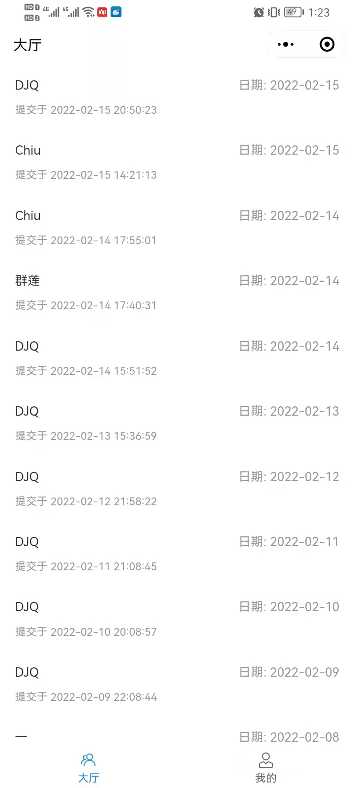

## 简介
这是一个记录每日功课量的打卡小程序，目前适配了微信小程序和H5移动端，后端代码详见：https://github.com/drafish/discipline-clock-nestjs

## 扫码体验
### 微信小程序二维码

### H5移动端二维码

## 功能列表
* 登录页，含图片验证码
* 注册页，含邮箱验证码
* 修改密码页
* 微信授权登录
* 用户信息页
* 列表页
* 详情页
* 新建打卡
* 更新打卡

## 项目截图

## 技术栈
* 小程序框架: taro+react
* UI组件库: vantui
* 数据流方案: dva
* 开发语言: TypeScript
* CSS预处理器: Less
* 代码规范: Prettier
